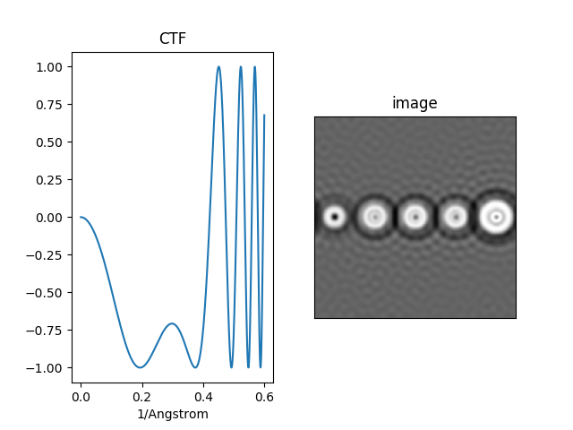

### Electron Microscopy Imaging Simulation

#### 1. Single atom imaging
The atomic projected potential is computed according to Kirkland (2009, P.82).

Shown above is a simulated image for 5 atoms (C, Si, Cu, Au, U from left to right).
Left pannel shows the projected potential.
